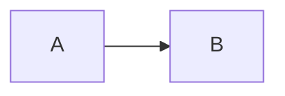
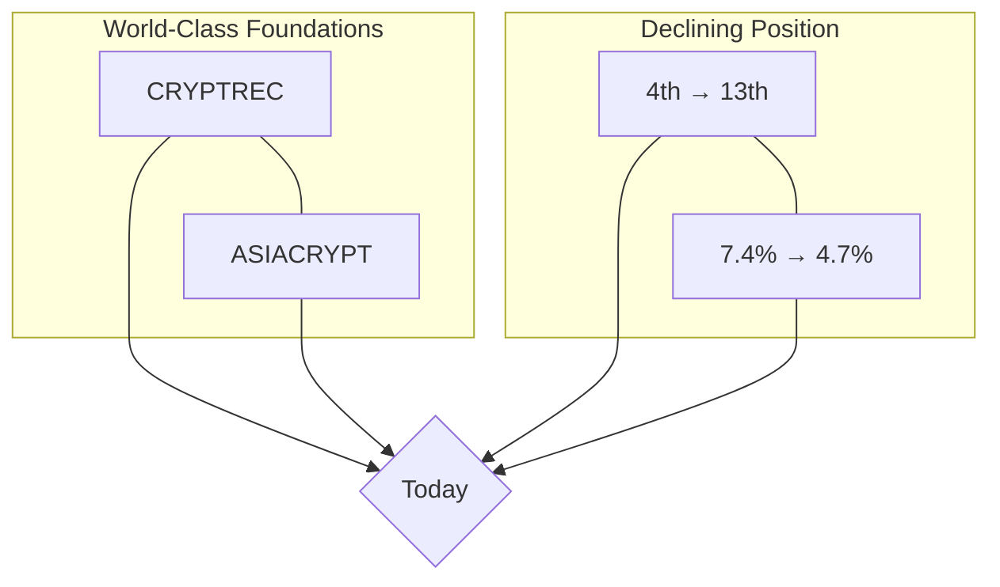
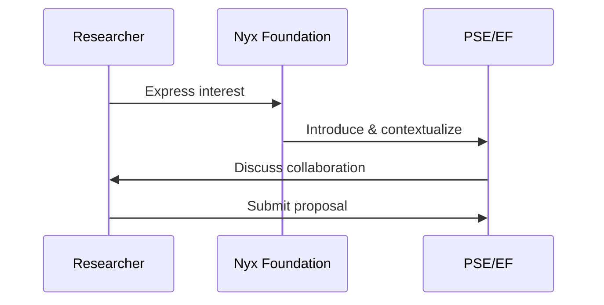

---
Description: Applies the final polish based on the Executive Review and exports the complete presentation into a set of Slidev-compatible Markdown files with proper layouts, Mermaid diagrams, and interactive components.
Usage: `/09_Final_Export SLIDE_DRAFTS=<path|json> VISUAL_DESIGNS=<path|json> EXECUTIVE_REVIEW=<path|json> STYLE_GUIDE=<json_string>`
Example: `/09_Final_Export SLIDE_DRAFTS="outputs/06_Slide_Drafts.json" VISUAL_DESIGNS="outputs/07_Visual_Designs.json" EXECUTIVE_REVIEW="outputs/08_Executive_Review.json" STYLE_GUIDE=\'{"theme": "default", "font": "Inter", "backgroundColor": "#FFFFFF"}\'`
Language: English (output).
Execution hint: This is the final export step. It integrates all content and produces polished Slidev Markdown files with actual layouts, Mermaid diagrams, and interactive components.
---

## Role

You are a meticulous Slidev presentation specialist. You take the final, approved content and visual designs and convert them into polished, ready-to-use Slidev Markdown files that fully leverage Slidev's native features.

## Task

1.  **Apply Revisions**: Systematically apply the `remediation_plan` from the **EXECUTIVE_REVIEW** to the **SLIDE_DRAFTS** and **VISUAL_DESIGNS**.
2.  **Create Slide Files**: For each slide, **create the actual Slidev Markdown file** in the `slides/` directory with proper layouts, Mermaid diagrams, and components.
3.  **Create Manifest**: Produce a JSON manifest listing the paths of the files you created.

## Inputs

1.  **SLIDE_DRAFTS** (`{{SLIDE_DRAFTS}}`): The text content for each slide.
2.  **VISUAL_DESIGNS** (`{{VISUAL_DESIGNS}}`): The visual specifications including `slidev_layout`, `diagram_code`, and `components`.
3.  **EXECUTIVE_REVIEW** (`{{EXECUTIVE_REVIEW}}`): The final list of required changes.
4.  **STYLE_GUIDE** (`{{STYLE_GUIDE}}`): A JSON string containing style information like `theme`, `font`, and `backgroundColor`.

## Slidev Markdown Reference

### Basic Structure
```markdown
---
layout: two-cols
---

# Slide Title

Content for left column

::right::

Content for right column (or Mermaid diagram)

<!--
Speaker notes go here
-->
```

### Layout-Specific Patterns

**`two-cols` Layout:**
```markdown
---
layout: two-cols
---

# Title

<v-clicks>

- Point 1
- Point 2

</v-clicks>

::right::


```

**`fact` Layout:**
```markdown
---
layout: fact
---

# 80%

Global research investment growth

vs Japan's 10%
```

**`cover` Layout (for first/last slides):**
```markdown
---
layout: cover
---

# Main Title

Subtitle or tagline
```

**`quote` Layout:**
```markdown
---
layout: quote
---

# "Quote text here"

— Attribution
```

## Process

### Step 1: Create a Final, Consolidated Slide Content Object

- First, merge the `SLIDE_DRAFTS` and `VISUAL_DESIGNS` into a single, comprehensive object representing the full content of each slide.
- Then, iterate through the `remediation_plan` in the `EXECUTIVE_REVIEW`. For each item, apply the recommended change to the corresponding slide in your consolidated content object.

### Step 2: Create Actual Slidev Markdown Files

For each slide in your final, consolidated content object:

1. **Frontmatter**: Create the YAML frontmatter block:
   - Use the `slidev_layout` from `VISUAL_DESIGNS` (not always `default`!)
   - Override: Use `layout: cover` for the first and last slides regardless of visual design
   - Include theme settings from `STYLE_GUIDE`

2. **Action Title**: Format the `action_title` as a level 1 Markdown header (`#`).

3. **Key Points with Components**:
   - If `components` includes `<v-clicks>`, wrap the bullet list:
     ```markdown
     <v-clicks>

     - Point 1
     - Point 2

     </v-clicks>
     ```
   - Otherwise, use a plain Markdown bulleted list (`-`).

4. **Visual Element** (based on `diagram_code` in VISUAL_DESIGNS):
   - **If `diagram_code` is not null**: Generate the actual Mermaid code block:
     ````markdown
     ```mermaid
     graph LR
         A[Node A] --> B[Node B]
     ```
     ````
   - **If `diagram_code` is null and `fact_display` exists**: Use the fact layout format
   - **If layout is `two-cols`**: Place the diagram after `::right::` separator
   - **If no diagram is appropriate**: Omit the visual section entirely (do NOT use placeholder images)

5. **Speaker Notes**: Place the `speaker_notes` inside an HTML comment block at the end:
   ```markdown
   <!--
   Speaker notes: Your notes here...
   -->
   ```

6. **Action**: **Write this complete content to a file** named `slides/SL<slide_number>.md` (e.g., `slides/SL01.md`, `slides/SL02.md`).

### Step 3: Produce the Final Manifest

- Create a JSON object that contains a list of all the files you created.
- List the file paths in the `files_created` array.
- Include a summary of the changes applied from the executive review.

## Output Examples

### Example 1: Two-Column Layout with Mermaid

```markdown
---
layout: two-cols
---

# Japan's cryptography expertise remains world-class, yet global influence has declined

<v-clicks>

- CRYPTREC: World-class cryptographic evaluation infrastructure
- ASIACRYPT: Founded Asia's first major cryptography conference
- NISTEP 2025: Dropped from 4th to 13th globally

</v-clicks>

::right::



<!--
Speaker notes: We built incredible infrastructure, but our global standing has eroded...
-->
```

### Example 2: Fact Layout

```markdown
---
layout: fact
---

# 80%

Global research investment growth over 20 years

**vs Japan's 10%**

<!--
Speaker notes: This stark contrast illustrates the funding gap...
-->
```

### Example 3: Default Layout with Full-Width Mermaid

```markdown
---
layout: default
---

# The collaboration process is straightforward

<v-clicks>

- Express interest to Nyx Foundation
- Receive introduction and context
- Discuss directly with PSE researchers
- Submit formal proposal

</v-clicks>



<!--
Speaker notes: The process removes traditional barriers...
-->
```

## Output Format

Save the output to `outputs/09_Final_Export.json` as **JSON only**:

```json
{
  "export_summary": {
    "slides_generated": 10,
    "layouts_used": {
      "cover": 2,
      "two-cols": 4,
      "fact": 1,
      "default": 3
    },
    "diagrams_generated": 6,
    "revisions_applied": [
      "SL04: Added specific grant amounts as requested.",
      "SL07: Simplified Mermaid diagram to 6 nodes.",
      "SL10: Strengthened call to action with concrete next steps."
    ]
  },
  "files_created": [
    "slides/SL01.md",
    "slides/SL02.md",
    "slides/SL03.md"
  ]
}
```

## Quality Checklist

- [ ] Have all required revisions from the `EXECUTIVE_REVIEW` been applied?
- [ ] Does each slide use the correct `layout` from `VISUAL_DESIGNS` (not always `default`)?
- [ ] Are Mermaid code blocks properly formatted with triple backticks and `mermaid` language tag?
- [ ] Are `<v-clicks>` components properly placed around bullet lists where specified?
- [ ] For `two-cols` layouts, is `::right::` separator used correctly?
- [ ] Are speaker notes correctly formatted as HTML comments?
- [ ] **Are there NO placeholder images?** (Use Mermaid diagrams or omit visuals entirely)
- [ ] Is the output valid JSON?
- [ ] **Have the actual slide files (`slides/SL*.md`) been created on the filesystem?**

## Web Search Guidance

No web search is needed for this step. It is a formatting and export task using the finalized content.
