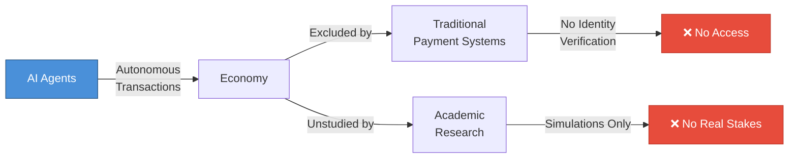

# AI agents are becoming autonomous economic actors, but no one is studying their behavior with real stakes.

<!--
Speaker Notes:
We are witnessing a fundamental shift in how economic activity occurs. AI agents are no longer just tools that assist humans—they are becoming autonomous economic actors capable of making independent decisions, executing transactions, and managing resources without human oversight. Yet there is a critical gap: no one is systematically studying how these agents behave when real stakes are involved. Traditional payment systems require human identity verification, which autonomous AI agents cannot provide. This means they cannot hold credit cards, bank accounts, or participate in conventional financial systems. Meanwhile, academic research on AI economic behavior relies almost entirely on simulations without real assets—a limitation that reduces behavioral realism. The result is that we are heading toward a future where AI agents participate significantly in our economy, but we have almost no empirical data on how they will actually behave when real value is at stake. This is not a theoretical problem—it is a research emergency that traditional institutions are structurally unable to address.
-->
