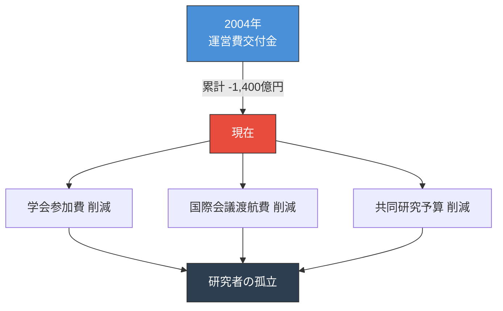

# 1,400億円の予算削減が研究者のつながりを断ち切った

::right::

2位→4位

論文数ランキング（20年間）

4位→10位

Top10%論文ランキング（20年間）

<!--
Speaker Notes:
この孤立は、個人の問題ではありません。構造的な問題です。2004年以降、国立大学の運営費交付金は累計で約1,400億円も削減されました。この数字が何を意味するか。学会への参加費、国際会議への渡航費、共同研究のための予算、これらが真っ先に削られました。結果として、研究者同士が出会い、議論し、協力する機会が大幅に減少したのです。データがこれを裏付けています。日本の論文数世界ランキングは、20年間で第2位から第4位に低下しました。さらに深刻なのは、インパクトの高いTop10%論文のランキングが、第4位から第10位へと大きく後退したことです。これは、孤立した研究環境がイノベーションを生む力を弱めていることの証拠です。皆さんを責めているのではありません。これはシステムの問題であり、だからこそシステムを変えるアプローチが必要なのです。
-->
