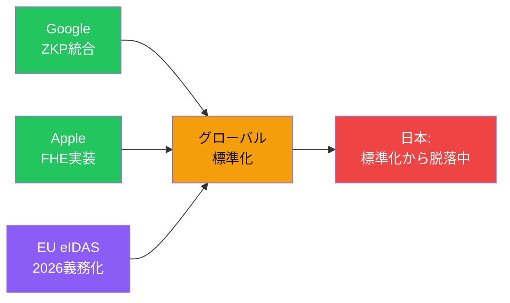

# GoogleもAppleもZKPを標準機能として実装—日本企業は取り残されつつある

<!--
Speaker Notes:
グローバル競争の現実を見てみましょう。2025年7月、GoogleはZKPをGoogle Walletに統合し、プライバシー保護型年齢確認機能を実装しました。さらに、この基盤技術をオープンソース化しています。AppleもFHE（完全準同型暗号）を活用した写真検索や発信者番号表示機能を提供しています。つまり、世界を代表するテック巨人たちは、Programmable Cryptographyを「研究段階」ではなく「製品の標準機能」として実装し始めているのです。規制面でも動きがあります。EU eIDAS 2.0は2026年に発効予定で、プライバシー保護デジタルIDウォレットの義務化が進みます。この規制はEU域内だけでなく、EU市場でビジネスを行うすべての企業に影響します。日本企業がこの流れに乗り遅れれば、グローバル市場での競争力を失うリスクがあります。
-->
