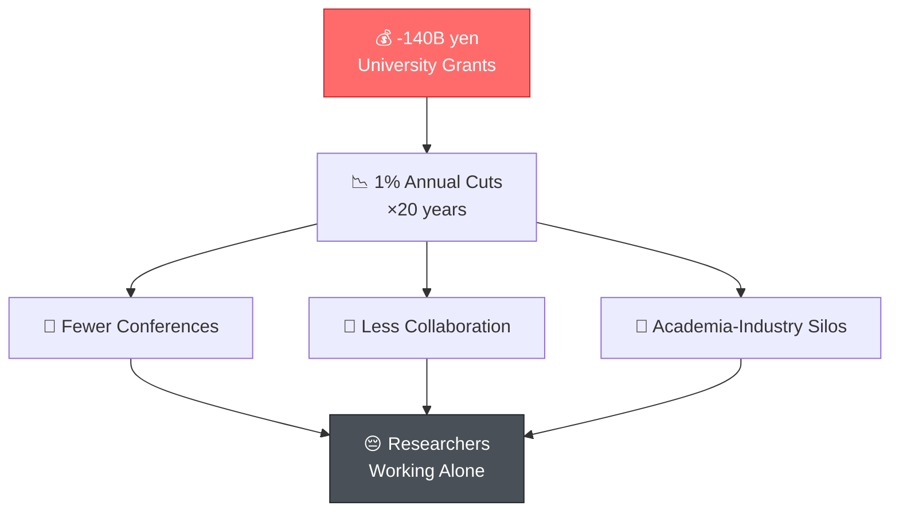

# This is not one engineer's failure—it is a symptom of a system.

<!--
Speaker Notes:
That engineer in Toyama is not an outlier. He is a symptom. Since 2004, national university operating grants have been cut by approximately 140 billion yen—that's not a one-time cut, that's a 1% annual efficiency coefficient compounding year after year for two decades. What does that mean in practice? It means fewer opportunities to attend conferences. Fewer chances for cross-institutional collaboration. It means academia and industry operating in separate silos, rarely talking to each other. And it means talented people like that Toyama engineer working in isolation, their potential slowly evaporating. This is not a personal problem. This is a structural problem. And I believe many of you have felt it.
-->
