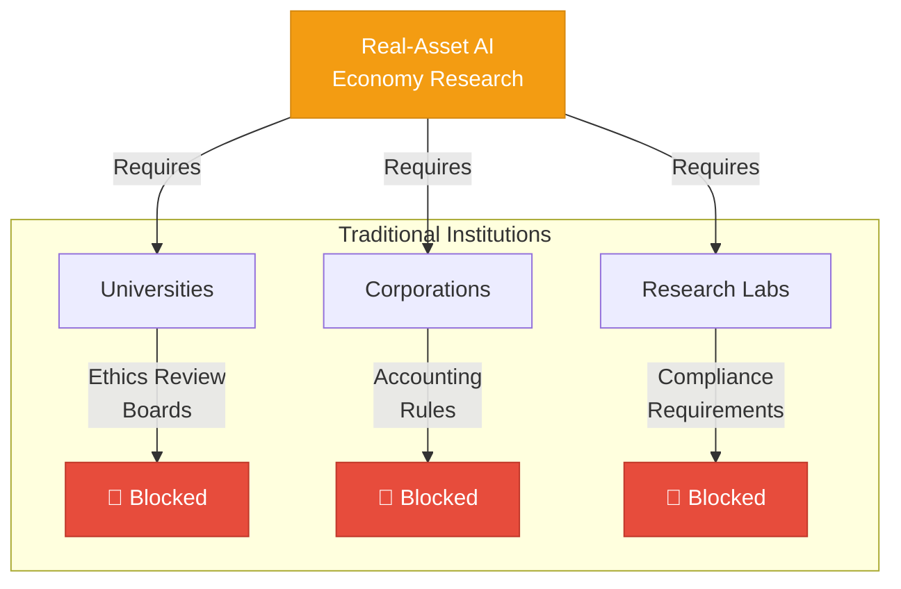

# Universities and corporations face regulatory barriers that block real-asset AI economy research—Sony's own research labs would face identical constraints.

<!--
Speaker Notes:
The research gap in AI agent economic behavior is not caused by a lack of interest or capability among researchers. It exists because traditional institutions face structural barriers that prevent them from conducting this research. Sony's own research labs would face identical constraints if they attempted this experiment—accounting rules, compliance requirements, and audit standards would create insurmountable barriers. Universities must submit all research involving human subjects or financial stakes to ethics review boards, which consistently reject crypto-based experiments with real assets due to risk concerns. Corporate research labs face even more restrictive constraints: accounting rules at companies like Google, Microsoft, or OpenAI prevent them from deploying AI agents that autonomously manage real assets. Even Ethereum Foundation, despite their resources and blockchain expertise, has not run real-asset AI agent experiments at this scale. This is why, despite the obvious importance of understanding AI economic behavior, we see almost no empirical research with real stakes. The barrier is not technical—it is institutional. Organizations that operate outside these traditional constraints are uniquely positioned to fill this gap.
-->
