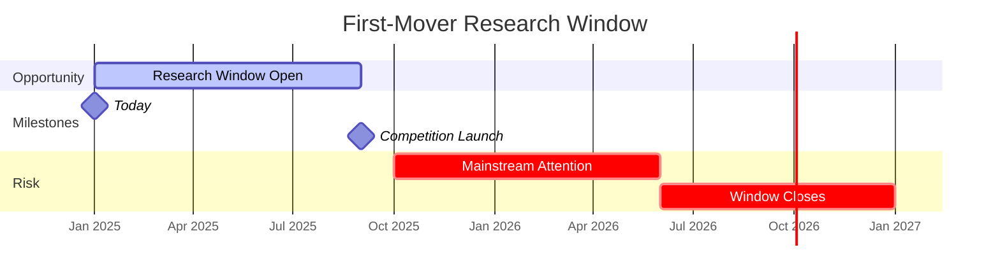

# A first-mover research window exists now—before AI economic participation accelerates and the opportunity closes.

<!--
Speaker Notes:
There is a time-sensitive opportunity here. AI agent capabilities are advancing rapidly, and it is only a matter of time before AI agents routinely participate in economic transactions—whether through crypto-native systems or through workarounds that bypass traditional payment infrastructure. When that happens, the organizations that have already conducted empirical research on AI economic behavior will hold a significant advantage. They will have established the conceptual frameworks, the measurement methodologies, and the foundational data that everyone else will reference. The first movers in this space will shape how we understand and regulate AI economic participation for decades to come. Our target date of September 2025 positions this research ahead of the inevitable mainstream attention that AI economic participation will attract. The question is not whether this research will happen—it will. The question is whether Sony wants to be part of establishing the foundational knowledge, or whether it will follow frameworks established by others. This is an opportunity to lead, not follow.
-->
