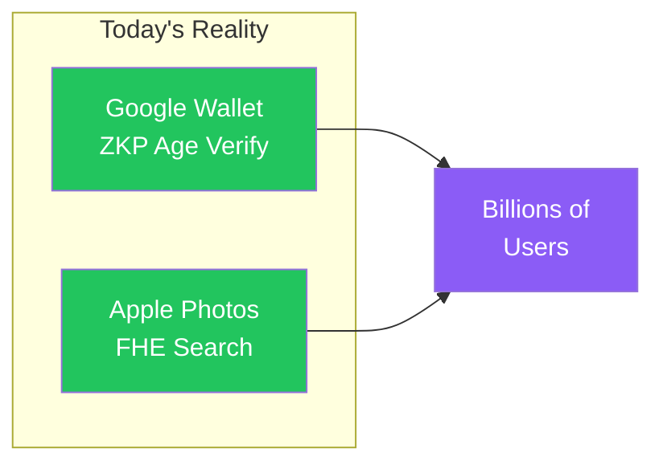

# 未来の技術ではない。今日の製品である。

<!--
Speaker Notes:
具体例を見てみましょう。Googleは2025年、ゼロ知識証明をGoogle Walletに統合しました。これにより、ユーザーは年齢確認が必要なサービスで、生年月日を開示せずに『18歳以上である』という事実だけを証明できるようになりました。プライバシーを守りながら本人確認を行う、まさにZKPの真骨頂です。さらにGoogleはこの技術をオープンソース化しており、業界標準としての地位を確立しようとしています。一方Appleは、完全準同型暗号（FHE）を活用し、写真検索や発信者番号表示機能を提供しています。この技術の特徴は、サーバー側でさえデータを解読できないという点です。ユーザーデータを処理しながら、そのデータ自体は誰にも見えない。これが数億人のiPhoneユーザーに今日提供されている現実です。つまり、Programmable Cryptographyは研究室の中の話ではありません。世界最大のテック企業が、消費者向け製品に実装済みの「今日の技術」なのです。
-->
