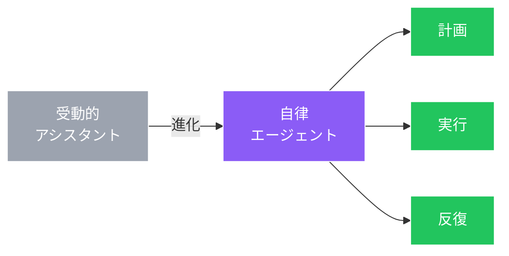

# アシスタントから自律エージェントへ

::right::

**早稲田大/理研AIP** — CHASE自律脆弱性発見

**警察庁/警察大学校** — LLMによるバイナリ解析

**富士通** — エージェント型セキュリティ研究

**パナソニック** — エージェント応用研究

<!--
Speaker Notes:
SCIS 2026の第一の大きなトレンドは、LLMベースエージェントの質的飛躍です。これらのシステムは、高度な検索エンジンやコード補完ツールの域を超えました。今やセキュリティタスクを計画・実行・反復できる自律的なアクターです。SCIS 2026では、早稲田大学と理研AIP、警察庁、警察大学校、富士通、パナソニックがいずれもエージェントベースのセキュリティ研究を発表しました。ベンチマークが示す重要な主張は、これらのエージェントが数か月分の手作業を数時間に圧縮できるということです。これは漸進的改善ではなく、可能性のカテゴリ自体が変わったのです。
-->
