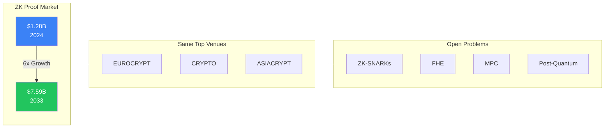

# A new frontier of cryptographic research has emerged where Japan's expertise could reclaim global influence

<v-clicks>

- Ethereum: a $400+ billion network securing trillions in annual transaction value
- Zero-knowledge proof market: $1.28B (2024) → $7.59B by 2033 (Grand View Research)
- Applied cryptography now appears in the same venues as theoretical work
- Open problems in ZK-SNARKs, FHE, MPC, and post-quantum cryptography await expert attention

</v-clicks>

::right::

<!--
Speaker notes: Here is the opportunity. Ethereum has evolved into a global financial infrastructure securing hundreds of billions of dollars. The zero-knowledge proof market is projected to grow from $1.28 billion to nearly $8 billion by 2033, according to Grand View Research's 2024 market analysis. The problems driving this—efficient proof systems, FHE, MPC, post-quantum resistance—are fundamental cryptographic challenges requiring exactly the theoretical rigor this room possesses. The same conferences that publish foundational work now publish Ethereum-related research. This is not a departure from academic cryptography—it is its newest frontier.
-->
