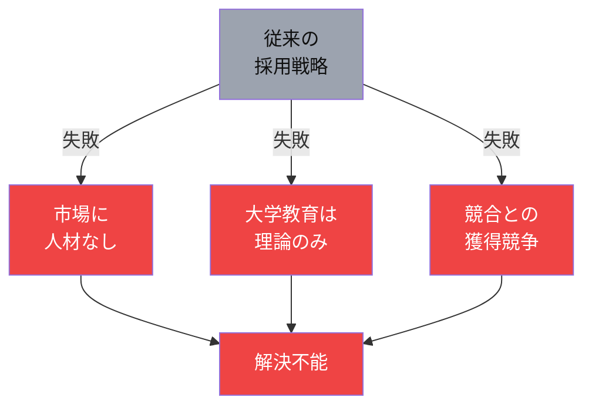

# 従来の採用戦略では、この専門人材ギャップを埋めることは不可能である

<!--
Speaker Notes:
では、なぜ従来の採用戦略ではこの問題を解決できないのでしょうか。まず、ZKP・FHE・MPCといったProgrammable Cryptographyを実装できる専門家は、市場にほぼ存在しません。これは一般的なソフトウェアエンジニア採用で解決できる問題ではないのです。大学の暗号理論教育は数学的な基礎に重点を置いており、実際にプロダクションレベルのコードを書ける実装スキルを習得する機会は限られています。さらに、外部採用に依存する限り、御社は他社との激しい人材獲得競争に巻き込まれ続けます。希少な人材を奪い合うゼロサムゲームでは、根本的な解決には至りません。必要なのは、自社に必要な人材を「育てる」という発想の転換です。
-->
