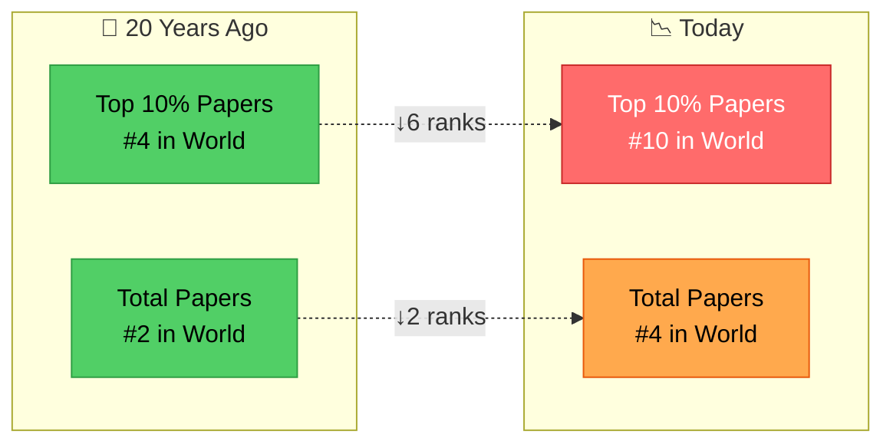

# Japan has fallen from 4th to 10th in global research impact—and the decline continues.

"Japanese science itself will decline" — NIRA

<!--
Speaker Notes:
Let me give you the numbers, because the numbers are alarming. Twenty years ago, Japan ranked 4th in the world for Top 10% highly-cited papers. Today, we rank 10th. In total research papers, we've dropped from 2nd to 4th. And the NIRA research institute has issued a stark warning: if this isolation continues, and I quote, 'Japanese science itself will decline.' These are not abstract statistics. This is our trajectory. And the trajectory is not flattening—it's still pointing down. We are watching Japanese research excellence erode in real time. The question is: what do we do about it?
-->
