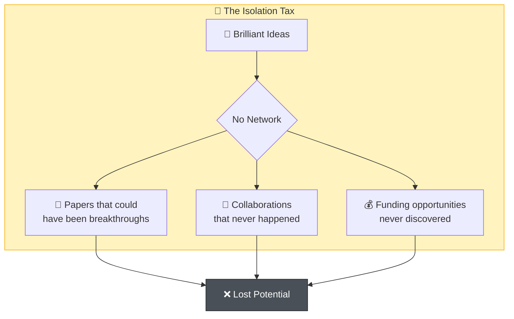

# We call it the Isolation Tax—and every researcher in this room is paying it.

<!--
Speaker Notes:
I want to give this problem a name. We call it the Isolation Tax. It's the invisible cost that every researcher in Japan pays when they work in isolation. It's the paper that could have been a breakthrough if you'd had someone to discuss it with. It's the collaboration that never happened because you never met the right person. It's the funding opportunity you never heard about because you weren't connected to the right network. When I was doing my master's, I had almost no opportunity to interact with students from other universities in the same field. I thought that was normal. I thought that was just how research worked. It took me years to realize: that's not normal. That's the Isolation Tax. And every person in this room has paid it, whether you realize it or not.
-->
