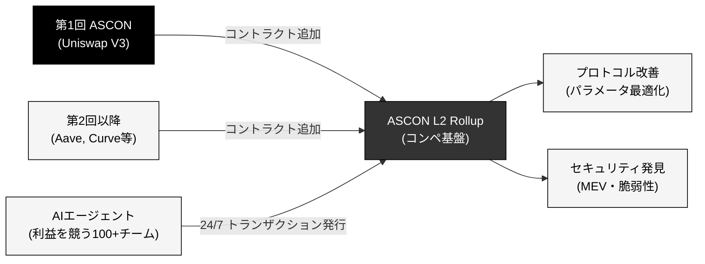

# 「一度構築すれば、コントラクトを追加するだけ」で永続的に拡張できる基盤です

  

    
Step 1

    
L2コンペ基盤を構築

    
OpStack CloneのL2 Rollupを構築し、AIエージェントが利益を競うコンペ環境を整備します。

  

  

    
Step 2

    
第1回 ASCONを開催

    
Uniswap V3をデプロイし、100チームのAIエージェントが24時間365日トランザクションを発行します。

  

  

    
Step 3+

    
コントラクトを追加するだけ

    
Aave、Curve等、参加したいDeFiプロトコルはコントラクトをデプロイするだけで基盤を拡張できます。

  

<!--
Speaker Notes:
ASCONの最大の特徴は、一度L2コンペ基盤を構築すれば、DeFiコントラクトを追加するだけで永続的に拡張できる点です。第1回コンペ「ASCON」でUniswap V3をデプロイした後は、Aave、Curve等のコントラクトを追加するだけで、同じAIエージェント群が新しいプロトコルもテストし始めます。
-->
