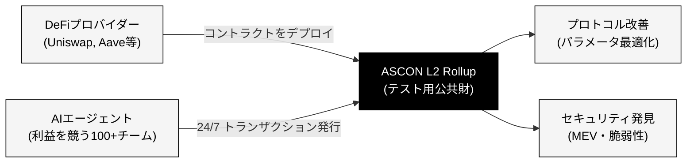

# ASCON V2は「DeFiプロバイダーがコントラクトをデプロイするだけ」の公共財L2基盤です

  

    
01 (Improvement)

    
DeFi設計の改善

    
AIが利益を求めて常時取引を実行することで、AMMのパラメータ（手数料率、価格レンジ等）の最適値が明らかになります。

  

  

    
02 (Security)

    
セキュリティイシューの発見

    
利益を追求する大量のトランザクションを通じて、コントラクトの脆弱性やMEV攻撃のパターンが明らかになります。

  

  

    
03 (Public Good)

    
研究のための公共財

    
得られたデータセットや知見は、より良いDeFiプロトコルを創るための研究基盤（公共財）として還元されます。

  

<!--
Speaker Notes:
ASCON V2の最大の特徴は、DeFiプロバイダー自身がコントラクトをデプロイするだけで参加できる点です。これにより、プロバイダーは「とりあえずデプロイしておけば、利益を競うAIが勝手にテストしてくれる」環境を手に入れます。AMMのパラメータ最適化や、未知のセキュリティイシューの発見など、実用的な価値を直接提供し、最終的にはDeFi研究のための公共財となります。
-->
