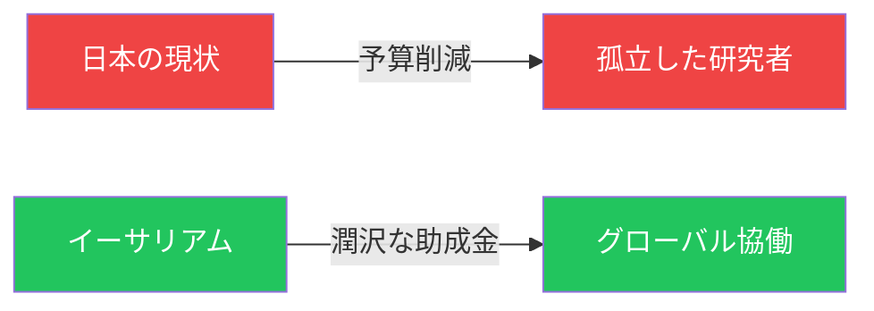

# 日本 vs イーサリアム

::right::

  
  
数兆円規模の機会

  
日本からの参入者：極めて少ない

<!--
Speaker Notes:
ここで視点を変えてみましょう。日本の研究環境が厳しくなる一方で、世界には別の動きがあります。イーサリアムです。イーサリアムは数兆円規模の資産が動く世界的なシステムであり、その安全性と発展を支えるために、イーサリアム財団をはじめとする組織が潤沢な研究助成金を提供しています。そして重要なことに、日本ではイーサリアム研究に本格的に取り組んでいる研究者がまだ極めて少ないのです。これは何を意味するか？競争相手が少ない今こそ、この巨大な機会を掴むべき時だということです。皆さんが持つ暗号・セキュリティの専門知識は、イーサリアムが最も必要としているものなのです。
-->
