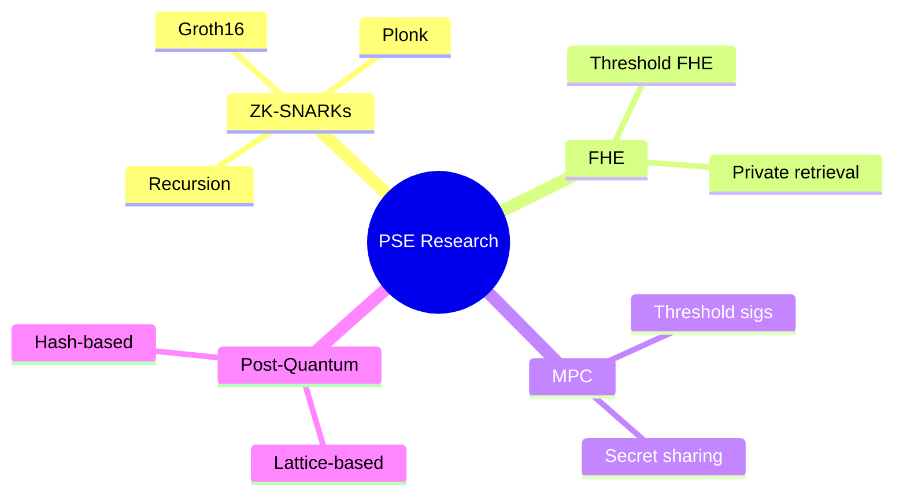

# Ethereum Foundation's research problems align directly with Japanese cryptographic expertise

<v-clicks>

- **Searchable encryption** expertise → ZK Email's privacy-preserving verification
- **Blockchain scalability** research → Layer-2 proof system optimization
- **CRYPTREC evaluation** experience → Post-quantum migration assessment
- **Formal methods** work → Protocol verification and cryptanalysis

</v-clicks>

::right::

<!--
Speaker notes: Let me be specific about the alignment. PSE works on problems immediately familiar to this audience. If your work involves searchable encryption, consider how ZK Email uses DKIM signatures for privacy-preserving verification—a direct application. If you've worked on blockchain scalability, layer-2 proof systems need exactly that expertise. CRYPTREC evaluators understand the rigor needed for post-quantum migration assessment. These aren't simplified problems—they're the same problems with massive real-world stakes. Over $28 billion currently sits in systems secured by zero-knowledge proofs. The research standards remain academic: formal security proofs, novel proof systems, rigorous cryptanalysis.
-->
