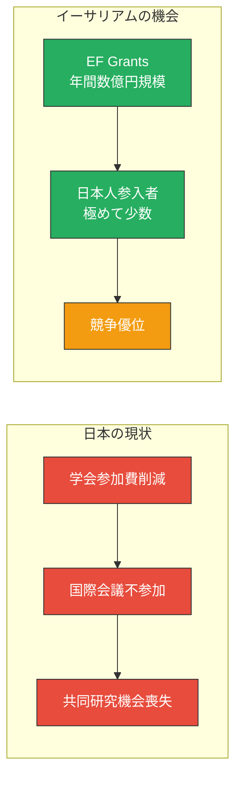

# 一方、イーサリアムには潤沢な研究助成金と、参入者が少ない巨大な機会がある

<!--
Speaker Notes:
ここで視点を変えましょう。暗い話ばかりではありません。皆さんの専門知識を待っている、巨大な機会があります。それがイーサリアムです。イーサリアムは、数兆円規模の資産が動く世界最大の分散型プラットフォームです。そして、そのエコシステムには、研究者を積極的に支援する文化があります。イーサリアム財団、Protocol Guild、様々なDAOが、潤沢な研究助成金を提供しています。最も重要なポイントは、日本からの参入者が極めて少ないということです。競争相手が少ない。つまり、今参入すれば、皆さんのような世界レベルの研究者にとって、大きなアドバンテージがあります。日本の国内予算が縮小する中、グローバルな資金源にアクセスすることは、研究を続けるための現実的な選択肢です。
-->
