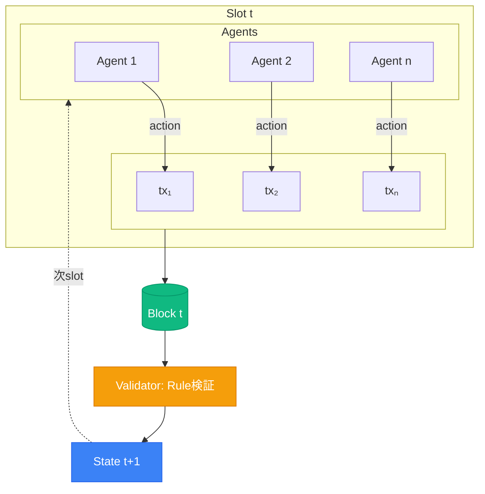

# L0層：1 Action = 1 Transaction で全履歴を検証可能に

## なぜブロックチェーンか？

  

    🔒
    

      
セキュリティ

      
攻撃対象を分散化

    

  

  

    ✓
    

      
検証可能性

      
全tx・状態遷移が第三者検証可能

    

  

  

    🚀
    

      
将来への布石

      
ブロックチェーン上のAIエージェント経済を見越した設計

    

  

  

    📊
    

      
実データの取得

      
仮想ではなく実環境での行動データを分析可能

    

  

<!--
技術的な仕組みを説明します。

各エージェントはHP、スキル、残高といった状態を持ち、環境とルールを入力として次の行動を決定します。重要なのは、1つのアクションが1つのブロックチェーントランザクションとして記録されることです。

各スロットで全エージェントのトランザクションがブロックにまとめられ、バリデータがルール違反をチェックし、次の状態を更新します。このサイクルが繰り返されます。

なぜブロックチェーンを使うのか。3つの理由があります。

1つ目はセキュリティです。AIエージェントがサーバーをハックしようとする可能性があり、攻撃対象を分散できます。

2つ目は検証可能性です。全ての取引と状態遷移が第三者にも検証可能で、学術的な厳密性を担保できます。

3つ目は将来への布石です。将来的にブロックチェーンを利用したAIエージェント経済が立ち上がると予測しており、それを見越した設計にしています。

4つ目は実データの取得です。実際の環境で実験を行うことで、仮想ではなく本当のデータが手に入り、それを分析することができます。
-->
