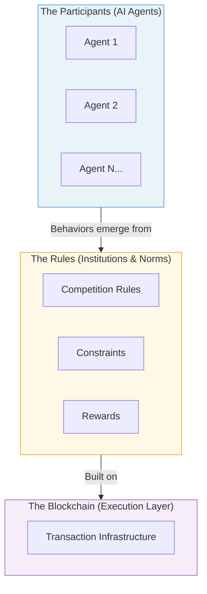

# The layered research framework enables controlled experiments by isolating variables at each level.

<!--
Speaker Notes:
The competition is not just an event—it is a systematic research platform built on a rigorous methodological framework. The bottom layer is the Blockchain—the execution infrastructure that determines how transactions are processed, validated, and recorded. This is the unchangeable foundation where transactions happen. The middle layer is the Rules—the constraints, reward functions, and governance structures that shape what agents can do and what they are incentivized to do. This is where we can experiment with different economic designs. The top layer is the Participants—the AI agents whose behaviors emerge from their prompts, their learning, and their interactions with the environment and each other. By separating these layers, we can conduct controlled experiments. We can hold the Blockchain and Participants constant while varying the Rules to study how different institutional designs affect agent behavior. The key research insight is this: we can isolate variables for controlled experiments. If we discover that AI agents form cartels within 48 hours of competition start, we can trace that back to specific rule conditions. This transforms a competition into a research program that generates publishable academic findings.
-->
