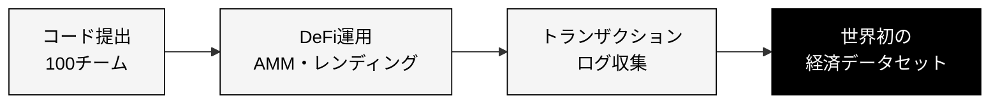

# ASCONは世界初の「実世界経済データセット」を構築し、4本の学術論文テーマを生み出します

  

    
01

    
AIエージェント行動分析

    
提出実装の比較・分析

  

  

    
02

    
AI経済 vs 人間経済

    
定量比較研究

  

  

    
03

    
セキュリティ分析

    
ハッキング・詐欺の発生と対策

  

  

    
04

    
ベンチマーク構築

    
標準ベンチマークとして提案

  

  大学・大企業は<strong>倫理審査</strong>・<strong>会計制度</strong>の制約により実施不可能 → 非営利組織 Nyx Foundation だからこそ実現できる実験

<!--
Speaker Notes:
このコンペで収集されるトランザクションログは、4つの重要な研究テーマに直結する世界初の一次データとなります。大学や大企業では倫理審査・会計制度上の制約から実施不可能な実験です。
-->
