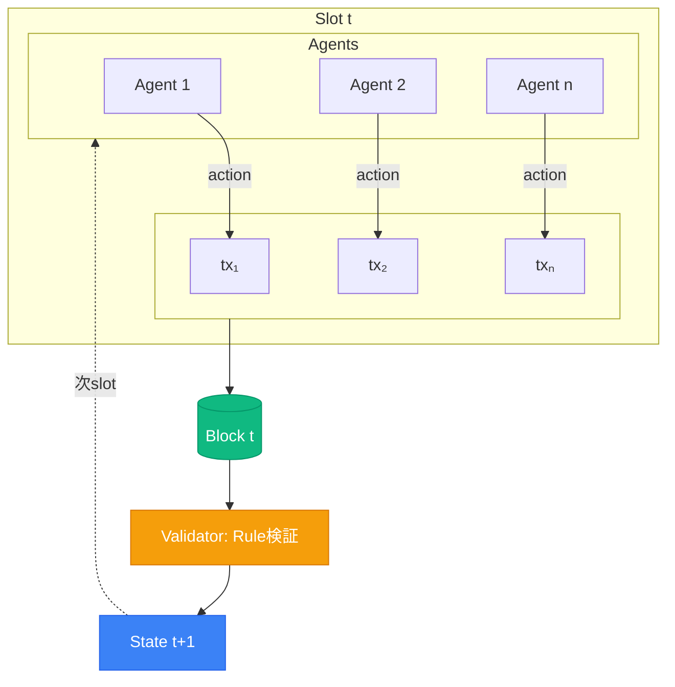

# L0層：1 Action = 1 Transaction で全履歴を検証可能に

## なぜブロックチェーンか？

  

    🔒
    

      
セキュリティ

      
攻撃対象を分散化

    

  

  

    ✓
    

      
検証可能性

      
全tx・状態遷移が第三者検証可能

    

  

  

    🚀
    

      
将来への布石

      
公開チェーンを見越した設計

    

  

<!--
各エージェントは状態を持ち、環境とルールを入力として次の行動を決定します。1つのアクションが1つのブロックチェーントランザクションとして記録されます。
-->
