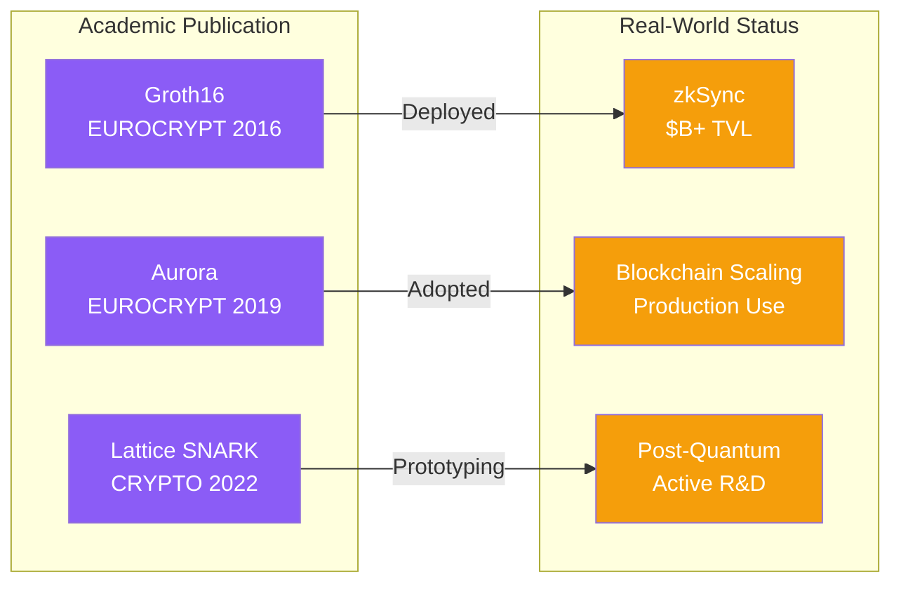

# The distinction between 'theory' and 'practice' has dissolved—Ethereum research appears in the same top venues

<v-clicks>

- **Groth16** (EUROCRYPT 2016): foundational pairing-based SNARK → deployed in zkSync ($B+ TVL)
- **Aurora** (EUROCRYPT 2019): transparent succinct arguments → adopted in blockchain scaling
- **Lattice-based SNARKs** (CRYPTO 2022): post-quantum secure construction → active R&D for migration
- Contributing institutions: Stanford, MIT, UC Berkeley, EPFL, and major Ethereum research teams

</v-clicks>

<!--
Speaker notes: If you have any doubt about academic legitimacy, consider the publication record. Jens Groth's EUROCRYPT 2016 paper—now universally called 'Groth16'—has become the foundation for billions in deployed infrastructure. Aurora, published at EUROCRYPT 2019, introduced transparent arguments now standard in blockchain scaling. At CRYPTO 2022, Albrecht and colleagues presented the first lattice-based SNARK that is post-quantum secure, publicly verifiable, and recursively composable—this remains in active R&D, not yet production deployment. The researchers come from Stanford, MIT, Berkeley, EPFL—institutions whose work you already cite. The venues are the same. The rigor is the same.
-->
