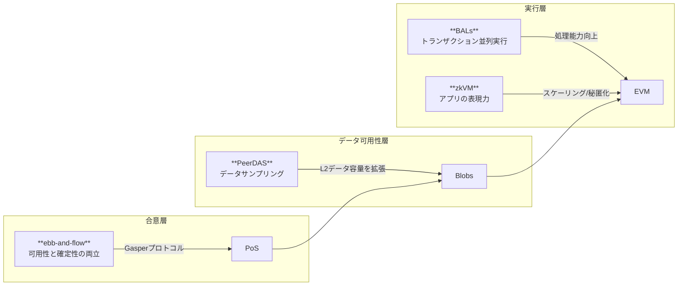

# イーサリアムの現在地：進化し続ける3層アーキテクチャ

```mermaid
flowchart LR
    subgraph 実行層
        B["**BALs**<br/>トランザクション並列実行"] -- "処理能力向上" --> E["EVM"]
        Z["**zkVM**<br/>アプリの表現力"] -- "スケーリング/秘匿化" --> E
    end

    subgraph データ可用性層
        P["**PeerDAS**<br/>データサンプリング"] -- "L2データ容量を拡張" --> D["Blobs"]
    end

    subgraph 合意層
        EF["**ebb-and-flow**<br/>可用性と確定性の両立"] -- "Gasperプロトコル" --> C["PoS"]
    end

    C --> D --> E
```

<!--
Speaker Notes:
このスライドは、イーサリアムが単一の技術ではなく「合意層・データ可用性層・実行層」の3層で進化していることを示します。ebb-and-flowはGasperの設計思想、PeerDASはL2データ拡張、BALs/zkVMは実行層の今後の強化ポイントです。
-->
