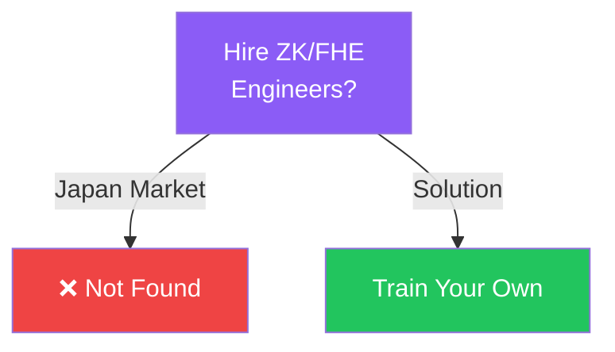

# 存在しない人材は、採用できない

<!--
Speaker Notes:
ここで皆さんの人事・採用部門に問いかけてみてください。『ゼロ知識証明を実装できるエンジニアを採用したい』と言われたとき、どこで候補者を探しますか。答えは明確です。日本の採用市場には、そのような人材はほぼ存在しません。なぜなら、Programmable Cryptography（ZK、FHE、MPC等）は、大学のカリキュラムにも、従来のプログラミングスクールにも含まれていない専門領域だからです。存在しない人材を「採用」することはできません。採れるのは「育成された人材」だけです。世界に目を向けると、この分野の専門教育プログラムは急増しています。0xPARCやZK Hackなどの育成プログラムが、世界中から優秀なエンジニアを輩出しています。しかし日本には、世界水準でこの分野の人材を育成できる基盤がほぼ存在しませんでした。通常の採用チャネルや人材紹介会社では、この構造的な問題を解決することはできません。必要なのは、人材を「採用する場所」ではなく、人材を「育成する場所」への投資なのです。
-->
