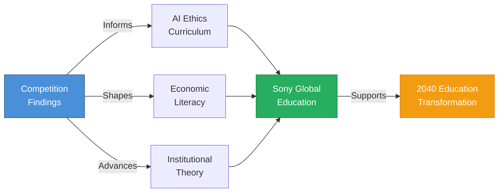

# Research findings become case studies for SGE's AI ethics curriculum—aligned with Isozu-san's 2040 vision.

**Concrete examples of curriculum content:**
- If agents form cartels within 48 hours → case study for AI ethics on emergent collusion
- If certain rule designs prevent manipulation → framework for economic governance courses
- If agents develop cooperative strategies under specific conditions → module on AI coordination theory

<!--
Speaker Notes:
The research value of this competition extends directly to Sony Global Education's core mission. Understanding how AI agents behave in economic contexts is not just an academic curiosity—it is essential knowledge for preparing future generations to live and work alongside increasingly autonomous AI systems. Let me be concrete about what this means for curriculum. If we discover that AI agents form cartels within 48 hours of competition start, that finding becomes a case study for SGE's AI ethics curriculum—showing students real evidence of emergent collusion behavior. If we find that certain rule designs prevent market manipulation, that becomes a framework for economic governance courses. If agents develop cooperative strategies under specific institutional conditions, that becomes a module on AI coordination theory. This aligns directly with Isozu-san's stated goal of preparing students for an AI-integrated future. The 2040 education transformation vision requires understanding how AI systems behave in economic contexts—and we will generate that understanding empirically, not theoretically. Sony Global Education is positioned to integrate these research findings into credential programs, learning platforms, and educational content—becoming a leader in preparing students for an AI-integrated economy.
-->
