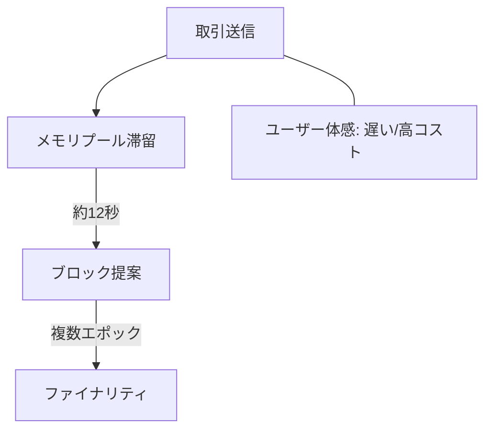

# 🦥 取引の遅延：世界コンピュータの応答速度

  

    

    

  

  

<strong>課題</strong>

<ul>
  <li>遅い確定時間によりUXが低下</li>
  <li>ブロックサイズ制限で混雑・高コスト化</li>
</ul>

<strong>取り組み事例</strong>

<ul>
  <li>Single Slot Finality (SSF)</li>
  <li>3-Slot Finality（36秒確定の研究）</li>
</ul>

<strong>研究テーマ</strong>

<ul>
  <li>分散システム：次世代コンセンサス設計</li>
  <li>アルゴリズム最適化：P2P伝播の高速化</li>
</ul>

<!--
Speaker Notes:
イーサリアムは「世界コンピュータ」を掲げていますが、応答速度はまだ遅い。ブロック生成は12秒、最終確定には約6分。UXを損ない、混雑時は手数料が高騰します。SSFや3-Slot Finalityなどの研究は、まさに分散システムやアルゴリズム分野の研究テーマです。
-->
