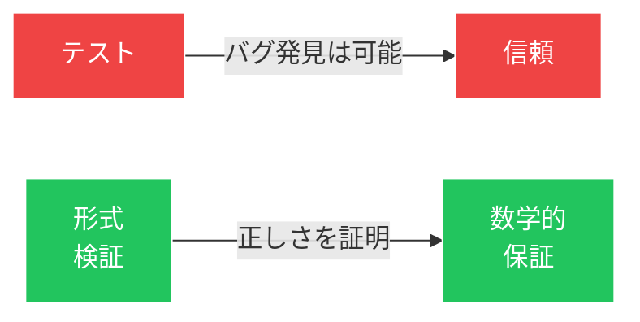

# 「希望」から「証明」へ

<!--
Speaker Notes:
第二の大きなトレンドは、形式検証が理論的学問から実用的エンジニアリングツールへと成熟したことです。長年、セキュリティコミュニティはテスト、コードレビュー、ファジングによって実装の信頼性を高めてきました。これらの手法は有用ですが、根本的に限界があります——バグの存在は示せても、バグの不在は証明できません。形式検証はゲームを根本的に変えます：テストに合格したから正しいと「期待する」のではなく、機械的に検証された数学的厳密さで「証明する」のです。SCIS 2026では、ProVerifなどのツールが複数の具体的な適用事例で取り上げられ、実用的な形式検証の発表が急増しました。
-->
