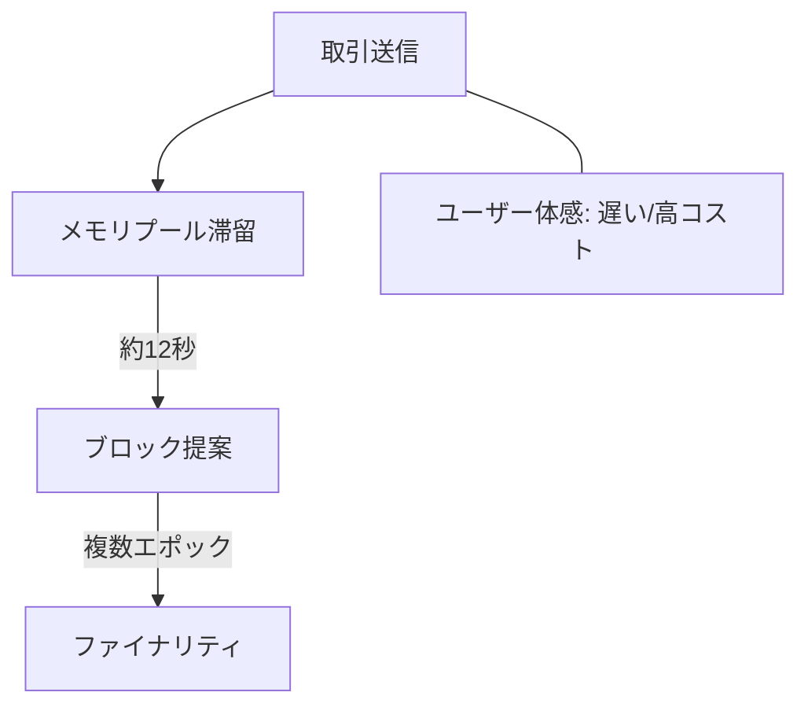

# 🦥 取引の遅延：世界コンピュータの応答速度

::right::

**課題**
- 遅い確定時間によりUXが低下
- ブロックサイズ制限で混雑・高コスト化

**取り組み事例**
- Single Slot Finality (SSF)
- 3-Slot Finality（36秒確定の研究）

**研究テーマ**
- 分散システム：次世代コンセンサス設計
- アルゴリズム最適化：P2P伝播の高速化

<!--
Speaker Notes:
イーサリアムは「世界コンピュータ」を掲げていますが、応答速度はまだ遅い。ブロック生成は12秒、最終確定には約6分。UXを損ない、混雑時は手数料が高騰します。SSFや3-Slot Finalityなどの研究は、まさに分散システムやアルゴリズム分野の研究テーマです。
-->
