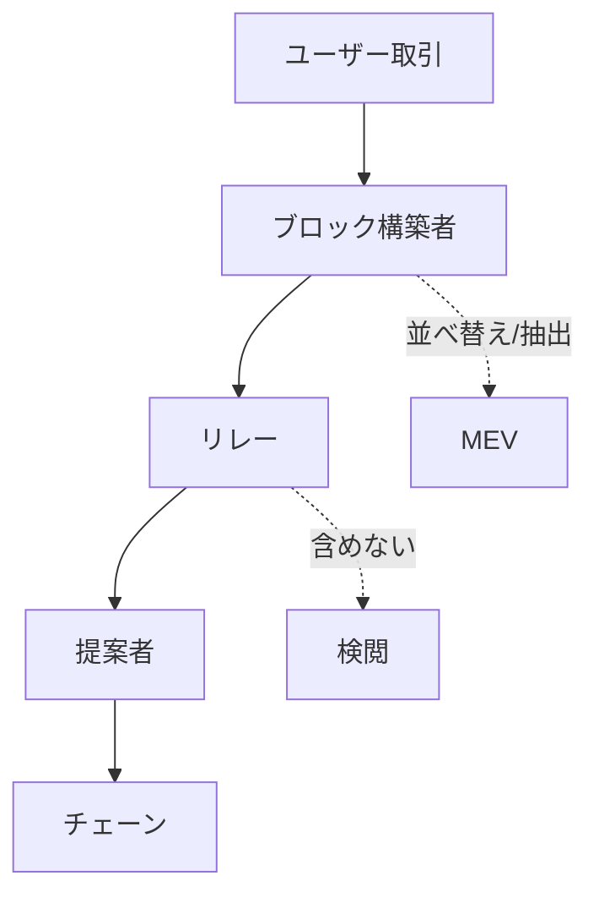

# 😈 MEVと検閲：公平性のゆらぎ

  

    

    

  

  

<strong>課題</strong>

<ul>
  <li>MEVが経済インセンティブを歪める</li>
  <li>取引の選別・検閲リスクが増大</li>
</ul>

<strong>取り組み事例</strong>

<ul>
  <li>PBS（提案者と構築者の分離）</li>
  <li>MEV-Boostの普及</li>
</ul>

<strong>研究テーマ</strong>

<ul>
  <li>メカニズム設計：公正なオークション/報酬</li>
  <li>検閲耐性：包含リスト設計と検証</li>
</ul>

<!--
Speaker Notes:
MEVは利益機会である一方、公平性を揺るがします。PBSは、ブロック構築者と提案者を分離することで、競争と透明性を導入する設計です。MEV-Boostの実装は進んでいますが、検閲耐性や経済設計は研究の余地が大きい分野です。
-->
