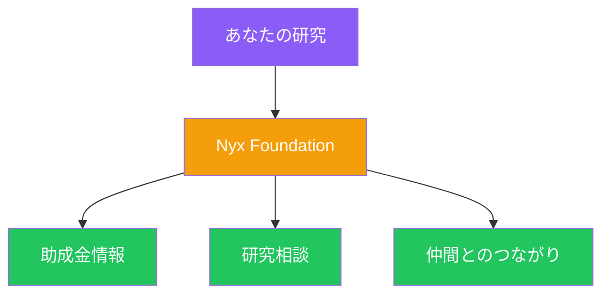

# 私たちができること

<!--
Speaker Notes:
Nyx Foundationは単に「信頼できる組織」というだけではありません。私たちは皆さんの挑戦を具体的にサポートするパートナーでありたいと考えています。具体的に何ができるか。まず、海外の研究助成金情報を日本語で共有します。イーサリアム財団PSEのRFPリストをはじめ、どこにどのような機会があるのかを分かりやすくお伝えします。次に、イーサリアムエコシステムに関する深い知見とネットワークを活かして、皆さんの研究テーマがどう貢献できるかを一緒に考えます。そして、学歴・職種・所属の垣根を越えて、志を同じくする仲間と出会える場を提供します。私たちは皆さんの上に立つ指導者ではなく、一緒に挑戦する仲間です。
-->
