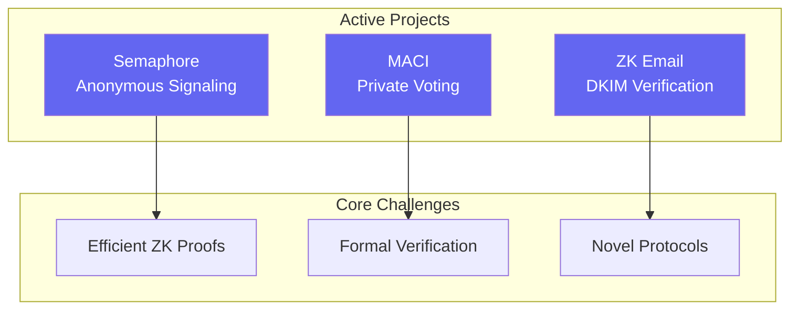

# PSE's research problems require exactly the expertise this room possesses

<v-clicks>

- **Semaphore**: Anonymous group signaling with double-spend prevention—efficient ZK proof construction
- **MACI**: Minimal anti-collusion infrastructure for private voting—formal verification needed
- **ZK Email**: Privacy-preserving email verification using DKIM—novel protocol design
- **Post-quantum migration**: $400B+ in assets requiring migration before quantum relevance

</v-clicks>

::right::

<!--
Speaker notes: Let me make this concrete. Semaphore lets users prove group membership without revealing identity while preventing double-signaling—the core challenge is efficient ZK proof construction. MACI enables private voting resistant to bribery, requiring formal verification and cryptanalysis. ZK Email allows privacy-preserving verification of email authenticity using existing DKIM signatures—a novel protocol design problem. And post-quantum migration is urgent: Ethereum holds over $400 billion in assets that will require migration before quantum computers reach cryptographic relevance. NIST PQC standardization is accelerating this timeline. These are frontier research questions with immediate applications—not simplified problems.
-->
