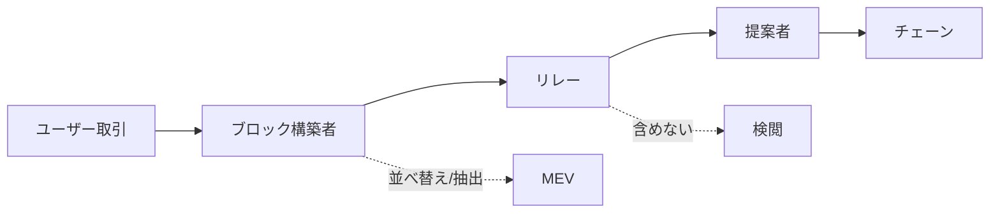

# 😈 MEVと検閲：公平性のゆらぎ

::right::

**課題**
- MEVが経済インセンティブを歪める
- 取引の選別・検閲リスクが増大

**取り組み事例**
- PBS（提案者と構築者の分離）
- MEV-Boostの普及

**研究テーマ**
- メカニズム設計：公正なオークション/報酬
- 検閲耐性：包含リスト設計と検証

<!--
Speaker Notes:
MEVは利益機会である一方、公平性を揺るがします。PBSは、ブロック構築者と提案者を分離することで、競争と透明性を導入する設計です。MEV-Boostの実装は進んでいますが、検閲耐性や経済設計は研究の余地が大きい分野です。
-->
