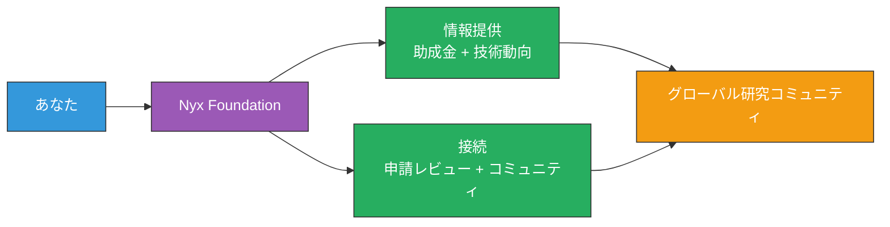

# 私たちが研究助成金情報を共有し、あなたの挑戦を全力でサポートする

<!--
Speaker Notes:
具体的に、私たちが提供できる価値についてお話しします。第一に、研究助成金情報の共有です。イーサリアム財団やエコシステムの様々な組織が公開するRFP、助成金プログラム、応募締め切りなどの情報を、日本語で皆さんに共有します。第二に、申請のサポートです。助成金申請書のドラフトをレビューし、フィードバックを提供します。何が評価されるか、どのような観点で書くべきか、私たちの経験に基づいてアドバイスします。第三に、技術的なサポートです。イーサリアムの技術スタック、研究の方向性、最新の動向について、質問があればいつでもお答えします。第四に、コミュニティへの接続です。グローバルな研究者との繋がりを作るお手伝いをします。共同研究の機会、カンファレンスでの発表、ワーキンググループへの参加など、様々な形で皆さんの研究活動を広げるサポートをします。
-->
