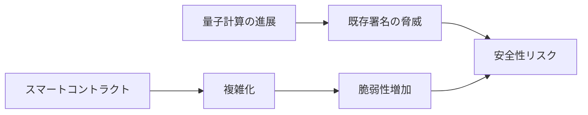

# 🛡️ セキュリティ：安全性の限界への挑戦

::right::

**課題**
- 量子計算による暗号の脅威
- コントラクト脆弱性の拡大

**取り組み事例**
- Certora（形式検証ツール）
- Immunefi（バグバウンティ）

**研究テーマ**
- 暗号理論：耐量子署名への移行設計
- プログラム検証：自動検証・仕様合成

<!--
Speaker Notes:
暗号資産の価値は「安全性」に支えられています。量子計算が既存の署名を脅かす未来は現実的です。さらに、スマートコントラクトの複雑化により脆弱性は増えています。形式検証やバグバウンティは進んでいますが、研究としての深掘りが必要です。
-->
