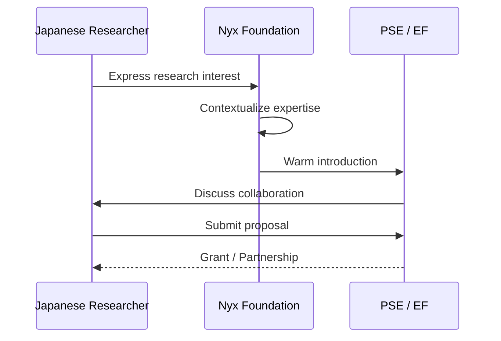

# Nyx Foundation bridges Japanese academic expertise to Ethereum research opportunities

<v-clicks>

- **Bridge function**: Connecting Japanese researchers with PSE and EF research networks
- **Cultural context**: Understanding of Japanese academic culture and Ethereum research priorities
- **Practical support**: Grant application assistance, technical context translation, warm introductions
- **Technical credibility**: Disclosed consensus edge cases in Lighthouse, contributed to Prysm slashing protection review

</v-clicks>

<!--
Speaker notes: This is where Nyx Foundation enters. Our role is straightforward: we reduce friction between Japanese academic expertise and Ethereum research opportunities. We understand both contexts—the rhythms of Japanese academic life and the priorities of Ethereum research. Concretely, this means grant application assistance, technical context translation, and warm introductions. We've built technical credibility through security contributions: we've disclosed consensus edge cases in Lighthouse and contributed to Prysm's slashing protection review. Why work with us rather than contacting PSE directly? You can contact them directly—we encourage it. Our value is removing barriers: navigating English-language grant processes, contextualizing your research for the Ethereum community, and providing ongoing support throughout collaboration. We're connectors, not gatekeepers.
-->
