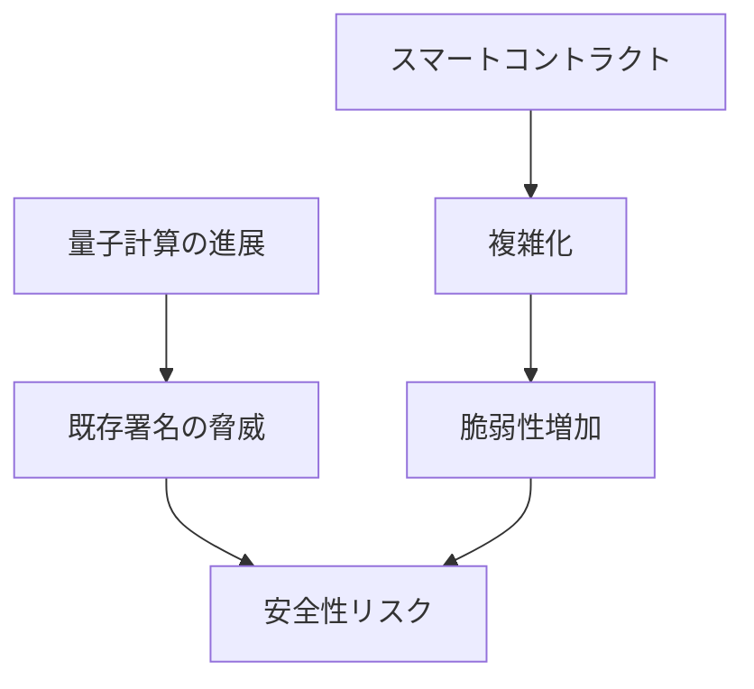

# 🛡️ セキュリティ：安全性の限界への挑戦

  

    

    

  

  

<strong>課題</strong>

<ul>
  <li>量子計算による暗号の脅威</li>
  <li>コントラクト脆弱性の拡大</li>
</ul>

<strong>取り組み事例</strong>

<ul>
  <li>Certora（形式検証ツール）</li>
  <li>Immunefi（バグバウンティ）</li>
</ul>

<strong>研究テーマ</strong>

<ul>
  <li>暗号理論：耐量子署名への移行設計</li>
  <li>プログラム検証：自動検証・仕様合成</li>
</ul>

<!--
Speaker Notes:
暗号資産の価値は「安全性」に支えられています。量子計算が既存の署名を脅かす未来は現実的です。さらに、スマートコントラクトの複雑化により脆弱性は増えています。形式検証やバグバウンティは進んでいますが、研究としての深掘りが必要です。
-->
