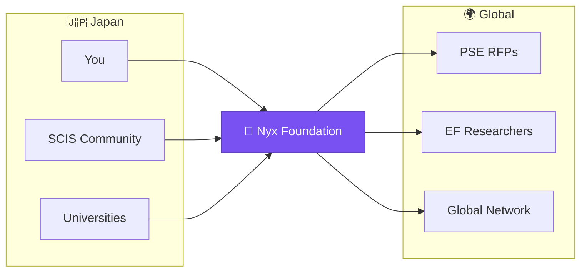

# The Nyx Foundation community exists to connect you to these problems—starting today.

<!--
Speaker Notes:
So what is Nyx Foundation, and why are we here? We are not a company trying to sell you something. We are a community that exists to be a bridge. I know this isolation personally. During my master's, I had almost no contact with researchers outside my institution. That experience is why I built this bridge. That's why I left the traditional path. Our founder broke away specifically to dismantle the walls isolating Japanese researchers. We founded the ZK Tokyo community. We built deep expertise and a global network within Ethereum. And now we're extending that bridge to you. If you're interested in exploring the PSE RFP list, we can help you navigate it. If you have research ideas that might fit the Ethereum ecosystem, we can help you connect with the right people. The bridge exists. It's real. And crossing it can start with a single conversation.
-->
