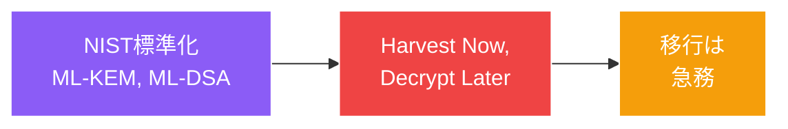

# PQC：「いつか」から「今」へ

<!--
Speaker Notes:
第三の大きなトレンドは、耐量子計算機暗号が理論的探求から標準化・初期導入へと決定的に移行したことです。NISTは耐量子アルゴリズムの選定を完了しました——鍵カプセル化にML-KEM、デジタル署名にML-DSA。これはもはや将来の懸念ではなく、現在の工学的命令です。「Harvest Now, Decrypt Later（今収穫し、後で復号）」という脅威モデルにより緊急性はさらに高まっています。高度な攻撃者は、十分に強力な量子コンピュータが利用可能になった時に復号する意図で、すでに暗号化された通信を収集しています。長期秘密情報にとって、移行の時計はすでに数年前に動き始めています。
-->
