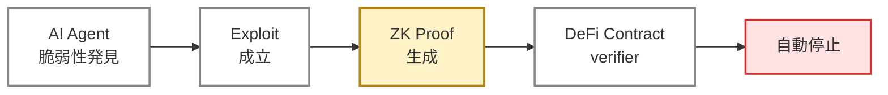

# S1-B. 暗号で守るだけでは足りない — <strong>フェイルストップ機構の証明</strong>

<strong class="text-amber-700">福島第一の教訓</strong> — 安全装置が「<strong>作動した証拠</strong>」を出せないと、紛争時に何も主張できない。 
最先端暗号は「機構が規定通りに発火した」事実を <strong class="text-amber-700">ZK 証明</strong>として出力できる。

Proof-of-Exploit — 社会実装版フェイルストップ機構

正しさの保証

運営の主張

&rarr; 数学的

機密性

exploit 公開

&rarr; witness 秘匿

自動化

人手介在

&rarr; on-chain で自動

紛争時の証拠

ログ (改ざん可)

&rarr; 暗号的に拘束

<!--
Speaker Notes:
S1-B は、暗号で守ったとしてもそれだけでは足りないという話です。安全装置が作動した証拠を出せないと、紛争のときに何も主張できません。これは福島第一原発の事故を思い出してください。安全装置が「動いた」のか「動かなかった」のか、後から検証する手段がなかった。これと同じことが、デジタルシステムでも起きます。最先端暗号は、「機構が規定通りに発火した」を ZK 証明として出力できる。具体例が Proof-of-Exploit です。図のフローです。AI エージェントが脆弱性を発見して、exploit を成立させた事実を ZK 証明として出力する。DeFi コントラクトがその verifier となり、proof を受理したら自動停止する。これが社会実装版のフェイルストップ機構です。下のカードを見てください。従来の検知は運営の主張に依存し、exploit を公開せざるを得ず、人手が介在し、ログは改ざん可能でした。ZK Proof-of-Exploit はすべてを数学的・自動的・拘束的にします。守るだけでなく、守れた事実・破られた事実を検証可能にする、これが暗号の新しい役割です。
-->
