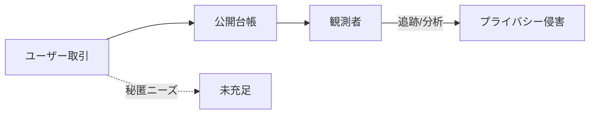

# 🤭 プライバシー：公開台帳の壁

::right::

**課題**
- 取引履歴が完全に公開される
- 企業・個人の秘匿ニーズに未対応

**取り組み事例**
- Stealth Address
- RAILGUN（ZK技術）

**研究テーマ**
- ゼロ知識：効率的な証明・集約
- コンプライアンス：選択的開示設計

<!--
Speaker Notes:
公開台帳の透明性は強みですが、同時にプライバシーの弱点です。Stealth AddressやRAILGUNのような技術が登場していますが、スケーラビリティや規制対応など研究課題が残ります。
-->
