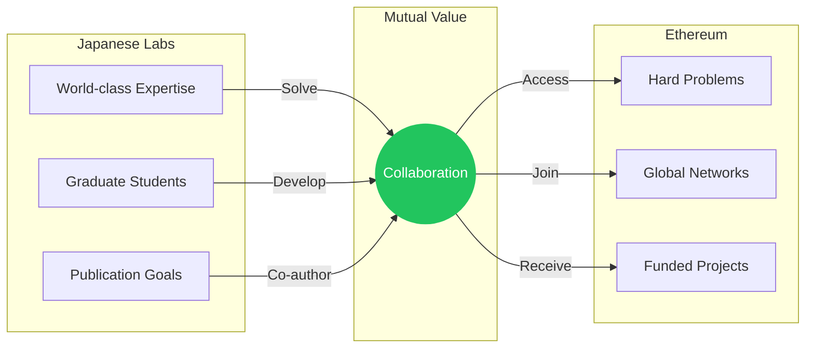

# These collaborations can benefit entire research groups, offering students global exposure

<v-clicks>

- **Graduate student development**: Exposure to international research networks and collaboration practices
- **Portfolio building**: Contributions to open-source cryptographic tools used globally
- **Publication pathways**: Co-authorship opportunities targeting top cryptography venues
- **Mutual benefit**: Japanese expertise addresses hard problems; researchers gain funded projects

</v-clicks>

::right::

<!--
Speaker notes: I want to speak directly to those who lead research groups. These collaborations can extend beyond your own work to benefit your students. Ethereum research offers genuine exposure to global networks. Students can contribute to open-source cryptographic tools, co-author papers targeting top venues, and gain experience collaborating internationally. This matters for the next generation of Japanese cryptographers—the isolation we discussed affects young researchers most acutely. International collaboration early in a career compounds over time. The structure is mutual benefit: Ethereum has genuinely hard problems requiring world-class expertise; Japanese cryptographers have that expertise but lack funded avenues to apply it globally.
-->
