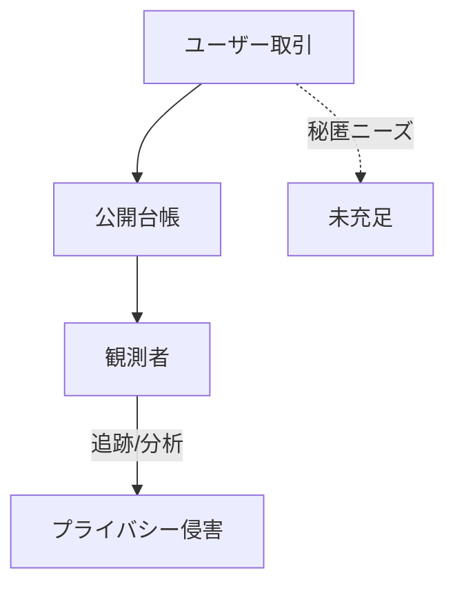

# 🤭 プライバシー：公開台帳の壁

  

    

    

  

  

<strong>課題</strong>

<ul>
  <li>取引履歴が完全に公開される</li>
  <li>企業・個人の秘匿ニーズに未対応</li>
</ul>

<strong>取り組み事例</strong>

<ul>
  <li>Stealth Address</li>
  <li>RAILGUN（ZK技術）</li>
</ul>

<strong>研究テーマ</strong>

<ul>
  <li>ゼロ知識：効率的な証明・集約</li>
  <li>コンプライアンス：選択的開示設計</li>
</ul>

<!--
Speaker Notes:
公開台帳の透明性は強みですが、同時にプライバシーの弱点です。Stealth AddressやRAILGUNのような技術が登場していますが、スケーラビリティや規制対応など研究課題が残ります。
-->
