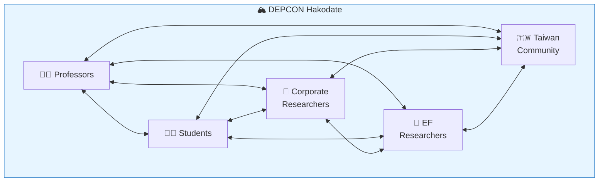

# At DEPCON Hakodate, professors, students, and EF researchers are already collaborating across borders.

<!--
Speaker Notes:
Let me give you a concrete example of what this collaboration looks like in practice. DEPCON Hakodate brings together university professors, graduate students, corporate researchers, Ethereum Foundation researchers, and members of the Taiwan Ethereum community. All in one room. It's an unconference-style format where anyone can propose a topic and lead a discussion—no formal hierarchy, just researchers talking about problems they care about. This is not a vision for the future—this is already happening. The walls that separate institutions, that separate countries, that separate academia from industry—at DEPCON, those walls come down. And the research that emerges from these collaborations is stronger because of it. The founder's conviction is that 'the era of researching alone or with just a few people is coming to an end.' DEPCON is proof that the new era is already beginning.
-->
