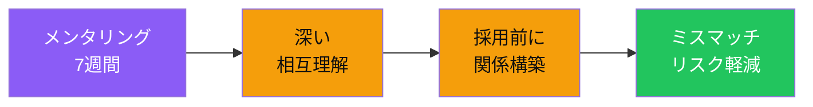

# メンタリング参加により、優秀人材との関係を採用前から構築できる

7週間

= 35時間以上の直接接触

通常面接

= 2-3時間のみ

<!--
Speaker Notes:
スポンサー企業の第二のメリットは、直接メンタリング機会です。スポンサー企業のエンジニアや技術責任者が、プログラム参加者へのメンターとして参加することができます。この7週間のメンタリング期間は、35時間以上の直接接触を意味します。通常の採用プロセスでは、履歴書と2-3時間の面接だけで候補者を評価しなければなりません。しかし、メンタリングを通じて得られる相互理解は、それよりも10倍以上深いものです。候補者の技術力だけでなく、問題解決へのアプローチ、コミュニケーションスタイル、チームへのフィット感まで、時間をかけて見極めることができます。これにより、採用後のミスマッチリスクを大幅に軽減することが可能です。
-->
