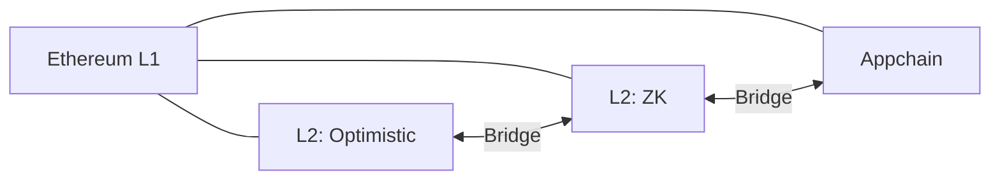

# 📡 インターオペラビリティ：分断されたL2

::right::

**課題**
- L2乱立で流動性が分断
- ブリッジの安全性がボトルネック

**取り組み事例**
- Shared Sequencer
- EIL（クロスL2統合の構想）

**研究テーマ**
- 分散台帳：クロスドメイン合意
- セキュリティ：ブリッジ検証と監査

<!--
Speaker Notes:
L2が増えるほど、流動性とユーザー体験は分断されます。安全なブリッジや共有シーケンサなどの構想はあるものの、実装と理論の両面で研究余地が大きい分野です。
-->
