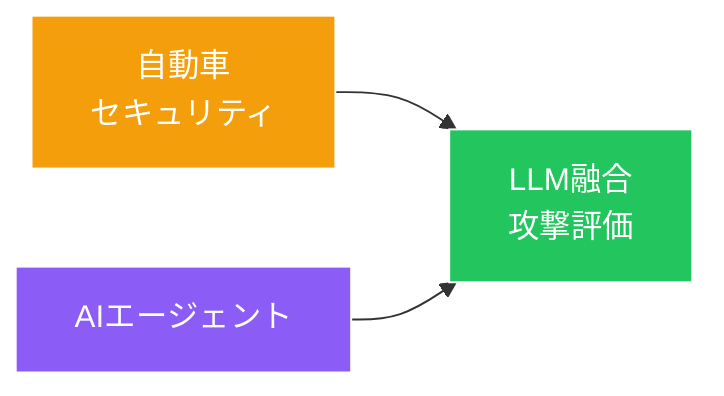

# 自動車セキュリティ×AI：新たな融合領域

::right::

 

**5セッション**がSCIS 2026で自動車セキュリティに割当

 

LLMを活用した攻撃評価手法が登場し、AIエージェントと自動車セキュリティの融合が始まっている

<!--
Speaker Notes:
SCIS 2026で見逃せないもう一つのトレンドが自動車セキュリティです。5つの専用セッションが設けられ、単独のトレンドとしても無視できない規模でした。特に注目すべきは、LLMを融合した攻撃評価手法が登場したことです。これは先ほど紹介したAIエージェントのトレンドが、自動車という具体的なドメインにも波及し始めていることを示しています。コネクテッドカーの普及に伴い、自動車セキュリティの重要性は今後さらに高まります。AIエージェントの自動化能力と自動車セキュリティの専門知識の融合は、まさにこれからの研究フロンティアです。
-->
