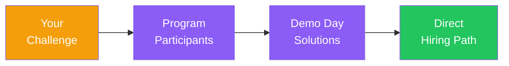

# テーマ提案権

<!--
Speaker Notes:
ここからはスポンサーシップの具体的な価値についてお話しします。ZK Core Program 2026のスポンサー企業には、最も差別化された特典として「テーマ提案権」が付与されます。これは何かというと、御社が抱える技術的課題や探索したいユースケースを、プログラムの研究テーマとして提案できる権利です。参加者はスポンサーから提案されたテーマに取り組み、6週間の学習の集大成として最終発表を行います。御社の課題に対して、優秀な人材が真剣に取り組み、その成果を御社に直接プレゼンテーションする。これは実質的に、インターンシップと研究開発委託のハイブリッドです。しかも、従来の採用活動では決して出会えなかった人材と、実際の課題解決を通じて接点を持てるのです。『この人材が欲しい』と思ったとき、すでにその人材は御社の課題に取り組んだ経験があり、御社のことを理解している。これほど効率的な人材発掘の方法は他にありません。
-->
