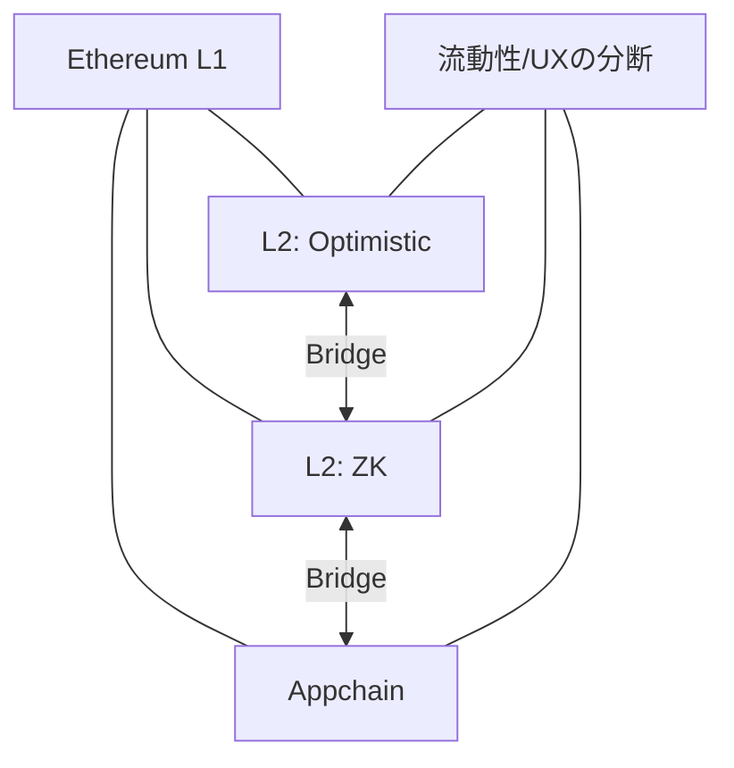

# 📡 インターオペラビリティ：分断されたL2

  

    

    

  

  

<strong>課題</strong>

<ul>
  <li>L2乱立で流動性が分断</li>
  <li>ブリッジの安全性がボトルネック</li>
</ul>

<strong>取り組み事例</strong>

<ul>
  <li>Shared Sequencer</li>
  <li>EIL（クロスL2統合の構想）</li>
</ul>

<strong>研究テーマ</strong>

<ul>
  <li>分散台帳：クロスドメイン合意</li>
  <li>セキュリティ：ブリッジ検証と監査</li>
</ul>

<!--
Speaker Notes:
L2が増えるほど、流動性とユーザー体験は分断されます。安全なブリッジや共有シーケンサなどの構想はあるものの、実装と理論の両面で研究余地が大きい分野です。
-->
