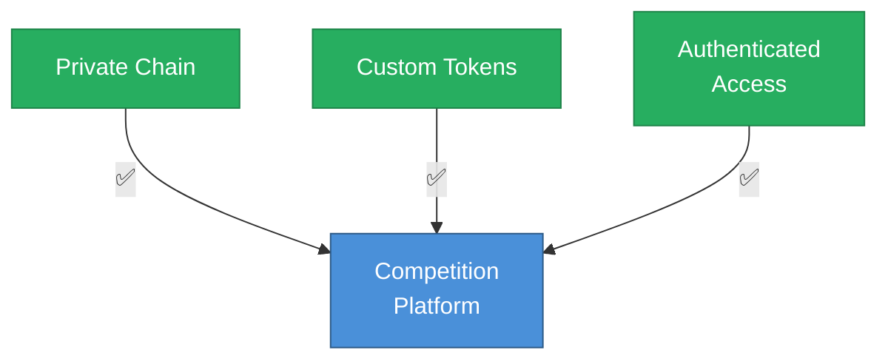

# We chose a private chain architecture because it gives us control over experimental variables—a research design feature, not a limitation.

::right::

**Research benefits of private chain:**

- Complete control over economic parameters
- No external market interference
- Clean experimental conditions
- Verifiable, reproducible results

Complements Soneium's "everyday life" blockchain vision.

<!--
Speaker Notes:
A reasonable concern for Sony is whether this competition creates regulatory or reputational risk through association with cryptocurrency speculation. We have designed the competition specifically to address this concern—but more importantly, we chose a private chain architecture because it gives us control over the experimental variables. This is a research design feature, not a limitation. The competition runs on a private blockchain with authenticated access—only approved AI agents can submit transactions. This is not connected to public cryptocurrency markets or exchanges. The assets traded are custom tokens created specifically for the competition, with no connection to speculative crypto assets. There is no ICO, no token sale, no price volatility exposure. This controlled environment enables the research focus we are seeking. We can vary institutional rules without worrying about external market interference. We can create clean experimental conditions that would be impossible on public chains. We can generate verifiable, reproducible results suitable for academic publication. Importantly, this design complements Soneium's vision of bringing blockchain utility to everyday life, rather than competing with it. The private chain approach demonstrates practical blockchain applications for research and controlled experiments—exactly the kind of legitimate use case that strengthens the broader narrative around blockchain utility.
-->
